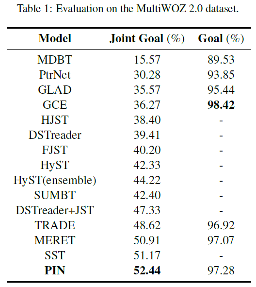
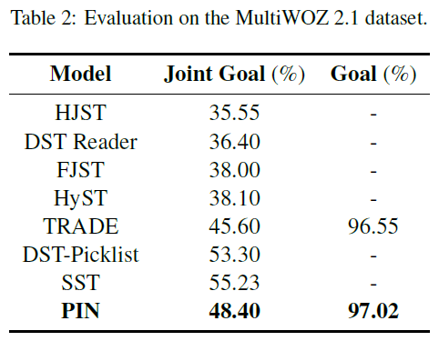

# PIN_EMNLP2020
The code and data for EMNLP 2020 paper: [Parallel Interactive Networks for Multi-Domain Dialogue State Generation](https://arxiv.org/pdf/2009.07616.pdf). The code is implemented using Pytorch.

## Description
In this project, we focus on the multi-domain dialogue state tracking (MDST) problem. In the existing MDST models, the dependencies between system and user utterances in the same turn and across different turns are not fully considered. In this study, we argue that the incorporation of these dependencies is crucial for the design of a MDST model. These dependencies exist because of the interactive nature of the dialogues. The interaction of the user and the system is often organized by a question-answering style. It is common in dialogue state tracking that a domain or slot being specified by one of the user or system, then the value being answered by the other. For example, in the dialogue in Figure 1, the user specifies a Restaurant domain, and the system answers a restaurant name Curry Garden. As is shown in Figure 1, both in-turn dependencies and cross-turn dependencies contribute to discovering slotv-alue pairs. Based on the the interactive nature of the dialogues, we build an Interactive Encoder which completely accords with the dependencies expressed in Figure 1 to jointly model the in-turn dependencies and cross-turn dependencies. As is shown in Figure 2, the Interactive Encoder consists of two parallel recurrent networks which interleave their hidden states.

   

We also consider the slot overlapping problem in MDST. Unlike single-domain DST, slot overlapping is common in MDST and these overlapping slots share the similar values. For example, both Restaurant and Hotel domain have a slot price range which shares the same values. Under this condition, a generator without considering slotspecific features may mistakenly extract the value of one slot as the value of some other slot. To overcoming the slot overlapping problem, we introduce a slot-level context in the state generator. In addition, we also propose a distributed copy mechanism to selectively copy words from historical system utterances or historical user utterances. The overall structure of the proposed model is shown in Figure 3.

  

Our implementation of the PIN model is based on the baseline model TRADE (Wu et al., 2019). We evaluate the models on the MultiWOZ2.0 dataset (Budzianowski et al., 2018) and MultiWOZ2.1 dataset (Eric et al., 2020). The compared models include the recent works SUMBT (Lee et al., 2019), HyST (Goel et al., 2019), DSTreader (Gao et al., 2019), DST-Picklist (Zhang et al., 2019), SST (Chen et al., 2020) and MERET (Huang et al., 2020). The evaluation results are shown in Table 1 and Table 2. The PIN model became a new state-of-the-art model on the MultiWOZ2.0 dataset. Although DST-Picklist and SST achieves better performance than PIN, DSTPicklist takes a lot human efforts in dividing the slots into span-based slots or picklist-based slots and SST requires extra relation information among the slots.

   

## Datasets
Both MultiWOZ2.0 and MultiWOZ2.1 datasets are publicly available. We provide the processed data as well as the raw data for these two datasets. The datasets can be downloaded from the [Google Drive](https://drive.google.com/drive/folders/1Hg2d9leN2RJ_sowcSLHC8g4JrFca8kRg?usp=sharing) or the [Baidu Cloud](https://pan.baidu.com/s/1qd9XhU_1N3GHfq95-d-_OA) (access code: hkw6).

## Training and Evaluation
+ Download the "__processed.zip__" from one of the dataset links. Unzip processed.zip and copy corresponding "__data__" directory into the root directory of the project.
+ Training: use the command __sh run.sh__ to run the models. You are expected to run the training script in the Python 3 environment.
+ Test: use the command __sh test.sh__ to evaluate the models. Note: running test script in the Python 3 environment may encounter unexpected errors, we suggest testing the models in the Python 2 environment.

## References
[Budzianowski et al., 2018] Pawel Budzianowski, Tsung-Hsien Wen, Bo-Hsiang Tseng, Inigo Casanueva, Stefan Ultes, Osman Ramadan and Milica Gasic. MultiWOZ-A Large-Scale Multi Domain Wizard-of-Oz Dataset for Task-Oriented Dialogue Modelling. In EMNLP 2018.

[Lee et al., 2019] Hwaran Lee, Jinsik Lee and Tae-Yoon Kim. SUMBT: Slot-Utterance Matching for Universal and Scalable Belief Tracking. In ACL 2019.

[Goel et al., 2019] Rahul Goel, Shachi Paul and Dilek Hakkani-Tur. HyST: A Hybrid Approach for Flexible and Accurate Dialogue State Tracking. In Interspeech 2019.

[Gao et al., 2019] Shuyang Gao, Abhishek Sethi, Sanchit Agarwal, Tagyoung Chung and Dilek Hakkani-Tur. Dialog State Tracking: A Neural Reading Comprehension Approach. In SIGdial 2019.

[Wu et al., 2019] Chien-Sheng Wu, Andrea Madotto, Ehsan Hosseini-Asl, Caiming Xiong, Richard Socher and Pascale Fung. Transferable Multi-Domain State Generator for Task-Oriented Dialogue Systems. In ACL 2019.

[Zhang et al., 2019] Jianguo Zhang, Kazuma Hashimoto, Chien-Sheng Wu, Yao Wan, Philip S. Yu, Richard Socher and Caiming Xiong. Find or Classify? Dual Strategy for Slot-Value Predictions on Multi-Domain Dialog State Tracking. CoRR 2019.

[Eric et al., 2020] Mihail Eric, Rahul Goel, Shachi Paul, Abhishek Sethi, Sanchit Agarwal, Shuyang Gao and Dilek Hakkani-Tur. MultiWOZ 2.1: A Consolidated Multi-Domain Dialogue Dataset with State Corrections and State Tracking Baselines. In LREC 2020.

[Chen et al., 2020] Lu Chen, Boer Lv, Chi Wang, Su Zhu, Bowen Tan and Kai Yu. Schema-Guided Multi-Domain Dialogue State Tracking with Graph Attention Neural Networks. In AAAI 2020.

[Huang et al., 2020] Yi Huang, Junlan Feng, Min Hu, Xiaoting Wu, Xiaoyu Du and Shuo Ma. Meta-Reinforced Multi-Domain State Generator for Dialogue Systems. In ACL 2020.
