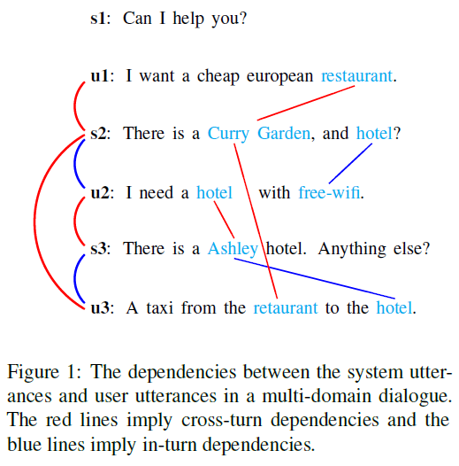

# PIN_EMNLP2020
The code and data for EMNLP 2020 paper: [Parallel Interactive Networks for Multi-Domain Dialogue State Generation](https://arxiv.org/pdf/2009.07616.pdf)

## Description
In this project, we focus on the multi-domain dialogue state tracking (MDST) problem. In the existing MDST models, the dependencies between system and user utterances in the same turn and across different turns are not fully considered. In this study, we argue that the incorporation of these dependencies is crucial for the design of a MDST model. These dependencies exist because of the interactive nature of the dialogues. The interaction of the user and the system is often organized by a question-answering style. It is common in dialogue state tracking that a domain or slot being specified by one of the user or system, then the value being answered by the other. For example, in the dialogue in Figure 1, the user specifies a Restaurant domain, and the system answers a restaurant name Curry Garden. As is shown in Figure 1, both in-turn dependencies and cross-turn dependencies contribute to discovering slotv-alue pairs. Based on the the interactive nature of the dialogues, we build an Interactive Encoder which completely accords with the dependencies expressed in Figure 1 to jointly model the in-turn dependencies and cross-turn dependencies. As is shown in Figure 2, the Interactive Encoder consists of two parallel recurrent networks which interleave their hidden states.

   

We also consider the slot overlapping problem in MDST. Unlike single-domain DST, slot overlapping is common in MDST and these overlapping slots share the similar values. For example, both Restaurant and Hotel domain have a slot price range which shares the same values. Under this condition, a generator without considering slotspecific features may mistakenly extract the value of one slot as the value of some other slot. To overcoming the slot overlapping problem, we introduce a slot-level context in the state generator. In addition, we also propose a distributed copy mechanism to selectively copy words from historical system utterances or historical user utterances. The overall structure of the proposed model is shown in Figure 3.

  

Empirical studies demonstrated the superiority of the proposed PIN model.
